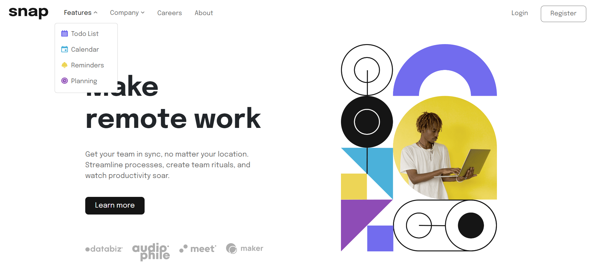

# Frontend Mentor - Intro section with dropdown navigation solution

This is a solution to the [Intro section with dropdown navigation challenge on Frontend Mentor](https://www.frontendmentor.io/challenges/intro-section-with-dropdown-navigation-ryaPetHE5). Frontend Mentor challenges help you improve your coding skills by building realistic projects. 

## Table of contents

- [Overview](#overview)
  - [The challenge](#the-challenge)
  - [Screenshot](#screenshot)
  - [Links](#links)
- [My process](#my-process)
  - [Built with](#built-with)
  - [What I learned](#what-i-learned)
  - [Continued development](#continued-development)
  - [Useful resources](#useful-resources)
- [Author](#author)
- [Acknowledgments](#acknowledgments)

## Overview

### The challenge

Users should be able to:

- View the relevant dropdown menus on desktop and mobile when interacting with the navigation links
- View the optimal layout for the content depending on their device's screen size
- See hover states for all interactive elements on the page

### Screenshot



### Links

- Solution URL: [Intro-section-with-dropdown-navigation](https://github.com/danielaser/Intro-section-with-dropdown-navigation)
- Live Site URL: [Intro section dropdown nav](https://intro-section-dropdown-nav.netlify.app/)

## My process

### Built with

- Semantic HTML5 markup
- CSS custom properties
- CSS Grid
- Mobile-first workflow
- [Bootstrap](https://getbootstrap.com/docs/5.3/getting-started/introduction/) - JS library
- [Styled Components](https://styled-components.com/) - For styles

### What I learned

When I started this challenge I decided to use a JS librery as Bootstrap because this tool is very useful for Navbars. Also, this librery has the
CSS and some JavaScript already implemented. I believe that if you wanat to build a simple but nice webside, Boostrap can be the best way to do it. 

Bootstrap example below:

```html
<nav class="navbar navbar-expand-lg">
      <div class="container-fluid mx-3">
```
```html
<div class="offcanvas offcanvas-end" tabindex="-1" id="offcanvasNavbar" aria-labelledby="offcanvasNavbarLabel">
    <div class="offcanvas-header justify-content-end pb-0">
        <button type="button" class="btn-close ps-4" data-bs-dismiss="offcanvas" aria-label="Close"></button>
    </div>
    <div class="offcanvas-body">
    </div>
```

### Continued development

I will continue with another challenges that help me to improve my JavaScript and try to implement SASS to go deep in CSS style.

### Useful resources

- [Bootstrap](https://getbootstrap.com/docs/5.3/getting-started/introduction/) - This helped me for make a nice intro page. I really liked this librery and will use it going forward.

## Author

- Website - [Daniela Serrano](https://github.com/danielaser)
- Frontend Mentor - [@danielaser](https://www.frontendmentor.io/profile/danielaser)

## Acknowledgments

As a junior developer I find a good documentation and examples that can help everyone who wants to build or add components to a project. There are many sides that can help us to find solutions and to use better programming practices [Useful resources](#useful-resources).
